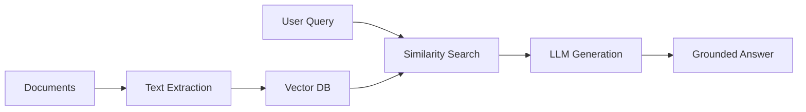
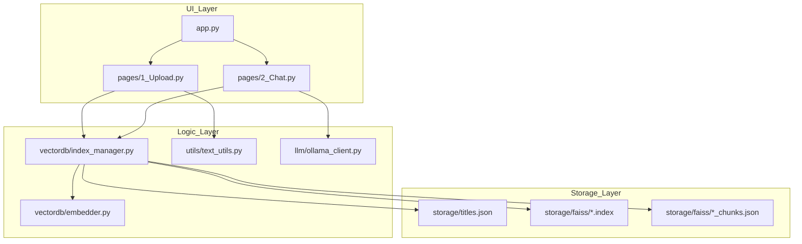

# VectorDB Chat: Local RAG with Streamlit, FAISS & Ollama

A professional, privacy-focused Retrieval-Augmented Generation (RAG) application that allows you to chat with your local documents using a vector database and local LLMs.

## Table of Contents
- [Overview](#overview)
- [Screenshots](#screenshots)
- [System Architecture](#system-architecture)
- [Project Structure](#project-structure)
- [Technology Stack](#technology-stack)
- [Installation & Setup](#installation--setup)
- [Developer Deep-Dive](#developer-deep-dive)
- [Learning Phase](#learning-phase)
- [License](#license)

## Overview

This project implements a complete RAG pipeline entirely on your local machine. It combines the speed of **FAISS** for vector similarity search, the flexibility of **Streamlit** for the UI, and the power of **Ollama** for grounded AI responses.

### High-Level System Flow


### Key Features
- **Local Multi-Format Parsing**: Support for `.txt`, `.md`, `.py`, `.pdf`, and `.docx`.
- **Advanced Chunking**: Overlapping paragraph-aware chunking for context preservation.
- **Title-Based Isolation**: Create multiple isolated knowledge bases ("titles") and switch between them seamlessly.
- **Streaming UI**: Token-by-token response streaming for a modern chat experience.
- **Privacy First**: All embeddings, indices, and LLM inferences stay on your local machine.


## Screenshots

### Upload:


---

### Chat


---

### Changing Documents


---

## System Architecture: File Interactions


---

## Project Structure

```bash
AutoRagOfDocs/
├── vectordb_chat/           # Core Application
│   ├── app.py               # Main Entry Point (Streamlit)
│   ├── run.py               # Startup script
│   ├── requirements.txt     # Dependency list
│   ├── pages/               # UI Page definitions
│   │   ├── 1_Upload.py      # Document ingestion & Index management
│   │   └── 2_Chat.py        # RAG Chat interface
│   ├── vectordb/            # Vector Database Logic
│   │   ├── embedder.py      # Sentence-Transformer wrapper
│   │   └── index_manager.py # FAISS & Registry management
│   ├── llm/                 # LLM Integration
│   │   └── ollama_client.py # Client for Ollama /api/chat
│   ├── utils/               # Shared Utilities
│   │   └── text_utils.py    # Parsing & Chunking logic
│   └── storage/             # Local Data Persistence
│       └── faiss/           # Stored .index and .json files
├── LearningPhase/           # Educational Modules (Line-by-line commented)
│   ├── text_extraction.py
│   ├── chunking_logic.py
│   ├── embedding_model.py
│   ├── vector_storage.py
│   ├── multi_storage_manager.py
│   ├── query_and_retrieval.py
│   ├── llm_integration.py
│   └── VectorDBpipeline.py  # Consolidated learning pipeline
└── README.md                # Project documentation
```

---

## Technology Stack

| Library                         | Purpose       | Rationale                                                      |
| :------------------------------ | :------------ | :------------------------------------------------------------- |
| **Streamlit**             | UI Framework  | Rapid development of interactive data apps.                    |
| **FAISS**                 | Vector Search | Highly optimized C++ based similarity search.                  |
| **Sentence-Transformers** | Embeddings    | `all-MiniLM-L6-v2` provides excellent speed/accuracy on CPU. |
| **Ollama**                | LLM Runtime   | Easiest way to serve high-performance local LLMs.              |
| **PyPDF2**                | PDF Parsing   | Lightweight text extraction from PDFs.                         |
| **python-docx**           | Word Parsing  | Robust extraction from `.docx` files.                        |

---

## Installation & Setup

### 1. Prerequisites

- Python 3.10+ (Tested on 3.13)
- [Ollama](https://ollama.ai/) installed and running.
- Pull the model: `ollama pull deepseek-coder:6.7b`

### 2. Clone and Install

```bash
git clone https://github.com/koffandaff/RAGForge.git
cd AutoRagOfDocs/vectordb_chat
pip install -r requirements.txt
```

### 3. Run the App

```bash
python run.py
```

Open [http://localhost:8501](http://localhost:8501) in your browser.

---

## Developer Deep-Dive: How it Works

### 1. The Ingestion Pipeline (`/Upload`)

When you upload a file, the system follows these steps:

1. **Extraction**: `utils/text_utils.py` uses `PyPDF2` or `python-docx` to turn files into a raw string.
2. **Chunking**: The string is divided into 500-word blocks with a 50-word overlap (to ensure meaning isn't lost at the cuts).
3. **Embedding**: The `vectordb/embedder.py` turns each chunk into a 384-dimensional vector.
4. **Indexing**: `vectordb/index_manager.py` stores these vectors in a FAISS index and the text in a JSON registry.

### 2. The Retrieval Flow (`/Chat`)

When you ask a question:

1. **Query Encoding**: The question is converted into a vector using the same model.
2. **Similarity Search**: FAISS calculates the **Cosine Similarity** (Inner Product of normalized vectors) to find the Top-K chunks.
3. **Context Pooling**: Chunks from multiple selected titles are pooled and sorted by relevance score.

### 3. The Generation Phase

1. **Prompt Construction**: The `llm/ollama_client.py` builds a role-based prompt using the `/api/chat` endpoint.
2. **Grounding**: The LLM is given strict system instructions to *only* use provided context.
3. **Streaming**: Tokens are yielded in real-time to the UI for better responsiveness.

---

## Learning Phase

For developers new to RAG, the `LearningPhase/` directory contains isolated, heavily-commented scripts. Each script explains a specific concept (e.g., how to calculate similarity math) without the complexity of the full app. We recommend starting with `LearningPhase/VectorDBpipeline.py`.

---

## 📜 License

MIT License - Free for educational and commercial use.
