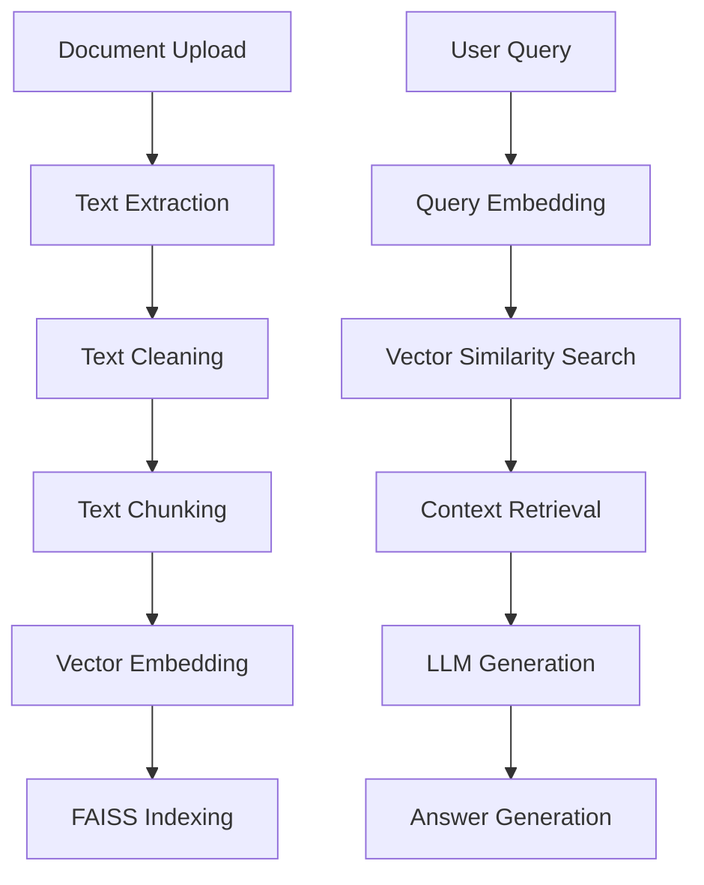

# Automated RAG Functionality and Logic

This document explains the logic behind the automated Retrieval-Augmented Generation (RAG) system.

## Core Components

The system consists of several automated modules that handle document ingestion, processing, and retrieval.

## Logic Explanation

### 1. Document Ingestion and Processing
- **Text Extraction**: Automatically detects file types (.txt, .md, .py, etc.) and extracts raw bytes into UTF-8 strings.
- **Text Cleaning**: Normalizes whitespace and removes redundant characters to ensure high-quality embeddings.
- **Overlapping Chunking**: Splits large documents into smaller pieces (default 500 words) with a small overlap (default 50 words) to maintain context between adjacent chunks.

### 2. Vector Database Management
- **Index Management**: Uses unique titles to organize documents. Each title corresponds to a separate FAISS index and local JSON storage for text chunks.
- **Embedding Generation**: Automatically converts text chunks into 384-dimensional vectors using the `all-MiniLM-L6-v2` Sentence Transformer model.

### 3. Retrieval and Generation
- **Similarity Search**: When a user asks a question, the query is embedded into the same vector space, and the FAISS index performs an Inner Product search to find the top instances of relevant text.
- **RAG Execution**: The retrieved chunks are formatted into a system prompt and passed to the local Ollama LLM along with the user's query and conversation history.
