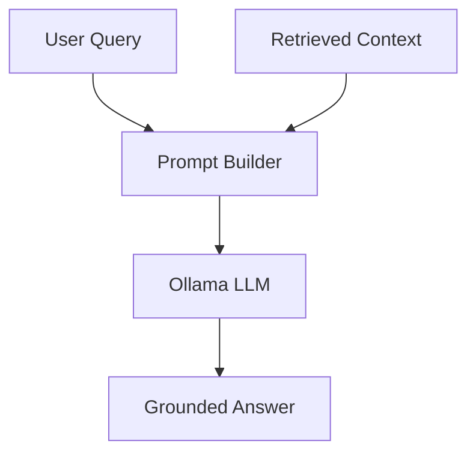
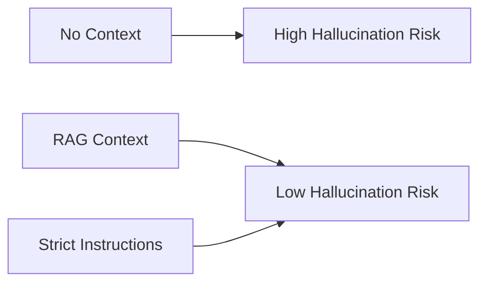

# LLM Interaction and Hallucination Avoidance

This document describes how the system interacts with the Large Language Model (LLM) and the strategies employed to prevent hallucinations.

## Prompt Construction

The system uses a structured prompt to guide the LLM's behavior. The prompt contains three primary sections:
1. **System Instructions**: Defines the persona (e.g., "helpful assistant") and sets the rules for answering.
2. **Context**: Provides the relevant text chunks retrieved from the vector database.
3. **Conversation History**: Includes previous interactions to maintain continuity.

## How the LLM Processes Information

The LLM receives the augmented prompt and uses the provided context as its primary source of truth. Instead of relying solely on its pre-trained weights, it synthesizes an answer using the specific data provided in the retrieval step.

## Strategies to Avoid Hallucination

### 1. Contextual Boundary
The system explicitly instructs the LLM: "Answer the question ONLY based on the provided context. If the answer is not in the context, state that you do not know."

### 2. Citation Requirements
The LLM is encouraged to cite specific parts of the context, which forces it to map its internal generation to the provided data.

### 3. Temperature Control
A lower temperature setting (e.g., 0.1 - 0.3) makes the model more deterministic and less likely to wander into creative but inaccurate territory. A higher temperature (0.7+) can be used for summarization but increases risk.

### 4. Ranking and Filtering
By only providing the top matches from FAISS, we minimize the noise and irrelevant information that could confuse the model.

