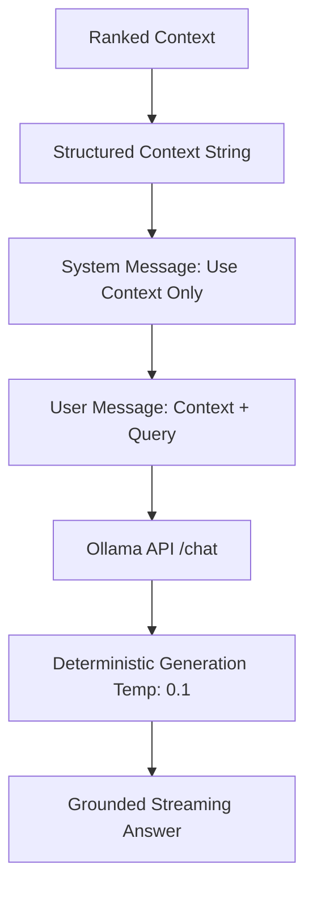

# Prompt Engineering and Output Generation

This document explains the final stage of the RAG pipeline: how retrieved relevance is used to generate grounded LLM responses.

## 1. Relevance Formatting

Once FAISS returns the best chunks, we must present them to the LLM in a structured way that emphasizes their importance.

### Formatting Logic:
```python
context_str = "\n".join([f"- {c.strip()}" for c in context])
```
We format the chunks as a clean, bulleted list. This structured presentation helps the model differentiate between separate pieces of evidence.

## 2. Prompt Architecture

We use a **Role-Based Prompt** using Ollama's `/api/chat` endpoint. This is more effective than the legacy `/api/generate` endpoint for strict grounding.

### The System Message
```python
{
    "role": "system",
    "content": "You are a helpful assistant. Use the provided context to answer the user's question accurately. If the answer is not in the context, say you don't know."
}
```
- **Role**: Setting the persona as a "grounded assistant".
- **Strictness**: The explicit instruction to "say you don't know" is the primary defense against hallucination.

### The User Message
```python
user_content = f"Context:\n{context_str}\n\nQuestion: {query}"
```
We clearly separate the **Context** (the facts) from the **Question** (the request). This prevents the LLM from getting confused between the two.

## 3. Output Generation Logic

### Parameter: `temperature=0.1`
Temperature controls the "creativity" of the model. 
- **Higher (0.7 - 1.0)**: Good for creative writing, but high hallucination risk.
- **Lower (0.0 - 0.2)**: Forces the model to be deterministic and pick the most likely "correct" words based *only* on the provided context. We use **0.1** to ensure accuracy.

### Streaming Execution: `chat_stream`
Instead of waiting for the full answer, we use a Generator to yield tokens:
```python
for line in response.iter_lines():
    chunk = json.loads(line.decode('utf-8'))
    yield chunk['message'].get('content', '')
```
This improved UX allows the user to start reading the answer **seconds faster** while the model is still processing the full response.

## 4. The Complete Grounding Flow



By combining **Strict System Instructions**, **Low Temperature**, and **Structured Context**, the system ensures that the LLM behaves like an accurate document search engine rather than a creative writer, minimizing hallucination and maximizing utility.
