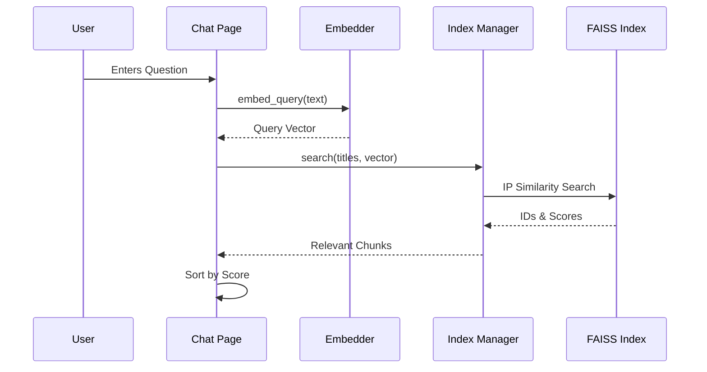

# Query Processing and Vector Search

This document explains the data flow when a user asks a question, from the raw string to the final context results.

## 1. Query Encoding

The user's query must be transformed into the exact same vector space as the documents.

### Code Logic: `Embedder.embed_query`
```python
embedding = self._model.encode(query, ...)
return embedding.reshape(1, -1)
```
- **Consistency**: It is vital that the query is encoded using the same model (`all-MiniLM-L6-v2`) and the same normalization as the documents. If it weren't, the mathematical relationship (distance) between the query and documents would be meaningless.
- **Reshaping**: FAISS expects a 2D array (batch of vectors), so we reshape the single query vector into a `1 x 384` matrix.

## 2. The Search Execution

### Code Logic: `IndexManager.search`
```python
# k is usually 4 to 10
distances, indices = index.search(query_embedding, k)
```

The search process performs an **Exhaustive Scan**:
1.  The query vector is compared against every single document vector in the index.
2.  The Inner Product is calculated for each pair.
3.  The results are sorted, and the top $k$ highest scores are returned.

### Mathematical Output:
- `indices`: `[[12, 45, 2, 7...]]` (The IDs of the best matches)
- `distances`: `[[0.85, 0.72, 0.65, 0.61...]]` (The similarity scores)

## 3. Multi-Title Aggregation

On the **Chat Page**, the user can select multiple knowledge bases.

### Code Logic in `pages/2_Chat.py`:
```python
for title in selected_titles:
    results = index_manager.search(title, prompt, k=k_chunks)
    for chunk, score in results:
        all_context.append({
            "title": title, "chunk": chunk, "score": score
        })

# Global Sorting
all_context.sort(key=lambda x: x["score"], reverse=True)
top_context = all_context[:k_chunks]
```
Rather than just taking the top from each document, we **pool** all results and sort them by their global similarity score. This ensures that if "Document A" has the 4 best answers, all 4 come from "Document A" instead of forcing one from "Document B".

## 4. Data Flow Summary


This multi-step refinement ensures that only the most semantically relevant information is ever sent to the LLM.
