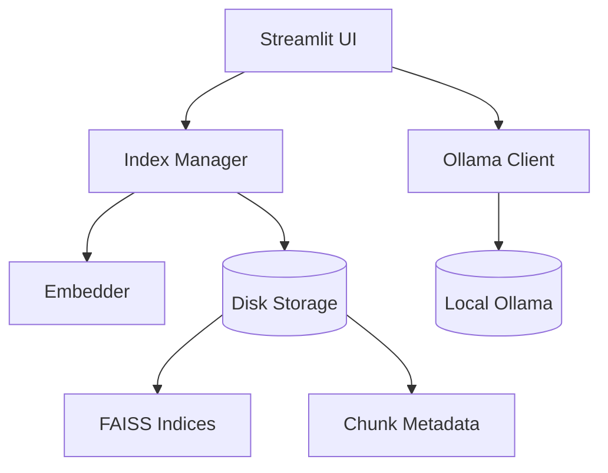

# Full System Report: VectorDB Chat App

This report provides a comprehensive overview of the architecture and functionality of the Streamlit RAG application.

## System Architecture

The application is built using a modular architecture to separate concerns between the user interface, data management, and language model interaction.

## Component Breakdown

### 1. User Interface (Streamlit)
- **app.py**: Main dashboard and navigation.
- **Upload Page**: Handles document ingestion, chunking, and index creation.
- **Chat Page**: Interactive interface for querying documents with context.

### 2. Vector Database (FAISS & Sentence-Transformers)
- **Embedder**: Manages the `all-MiniLM-L6-v2` model.
- **Index Manager**: Handles multiple distinct document collections (titles).
- **Indexing Mechanism**: 
    - Uses `IndexFlatIP` for inner product (cosine) similarity.
    - Chunks are stored in a flat list with a 1-to-1 mapping to the FAISS index IDs.
    - New documents are embedded and appended to the existing index and metadata store.
- **Storage System**: 
    - **Indices**: Stored as `.index` binary files using FAISS's native serialization.
    - **Metadata**: Document chunks are stored as `.json` files for human readability and easy retrieval after a vector match.
    - **Hierarchy**: Organized by `storage/faiss/{title}.index` and `storage/faiss/{title}_chunks.json`.

### 3. Language Model (Ollama)
- **Ollama Client**: Communicates with the local Ollama API.
- **Context Synthesis**: Logic for combining retrieved chunks with user queries.

## Performance Considerations

- **Local Execution**: All processing (embedding, indexing, inference) occurs locally, ensuring data privacy.
- **Efficiency**: FAISS provides extremely fast similarity searches even for large document collections.
- **Scalability**: New document "titles" can be created dynamically without affecting existing ones.

## Conclusion

The system implements a production-ready RAG architecture that allows users to chat with their documents while maintaining full control over their data and model execution.
