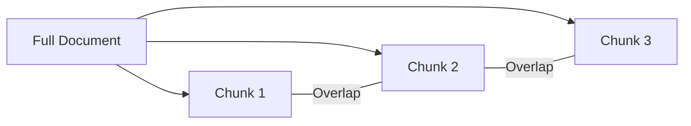
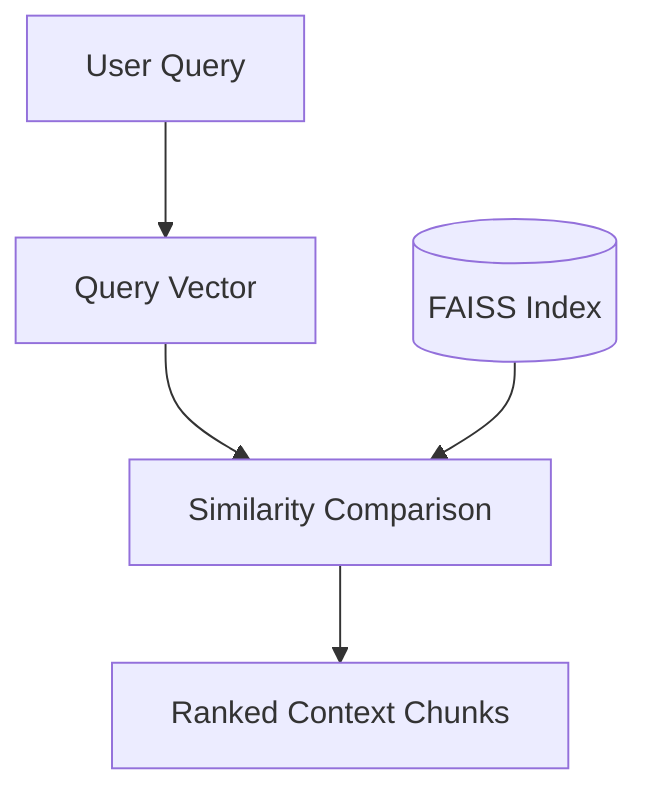

# Vector Search Details: Chunks and Embeddings

This document details the technical implementation of vector search, focusing on the importance of chunking and embedding representations.

## What are Chunks?

Chunks are granular segments of a larger document. Processing documents in chunks is necessary because:
1. **Model Constraints**: LLMs and embedding models have maximum token limits.
2. **Retrieval Precision**: Smaller, focused chunks allow for more precise matching than large documents which might contain irrelevant information.
3. **Context Preservation**: By using overlapping chunks, we ensure that information split at a chunk boundary is still captured in its surrounding context.

## What are Embeddings?

Embeddings are numerical representations of text in a high-dimensional vector space.
- **Semantic Meaning**: The position of the vector in space represents the semantic meaning of the text.
- **Mathematical Relationship**: Text segments with similar meanings are positioned close to each other in this space.
- **Dimensionality**: In this system, we use 384 dimensions, which provides a balance between descriptive power and computational efficiency.

## How Vector Search Works

1. **Query Transformation**: The user's query is converted into a vector.
2. **Metric Calculation**: The system calculates the similarity (typically Inner Product or Cosine Similarity) between the query vector and all chunk vectors in the index.
3. **Ranking**: The chunks with the highest similarity scores are selected as the most relevant context for the LLM.

